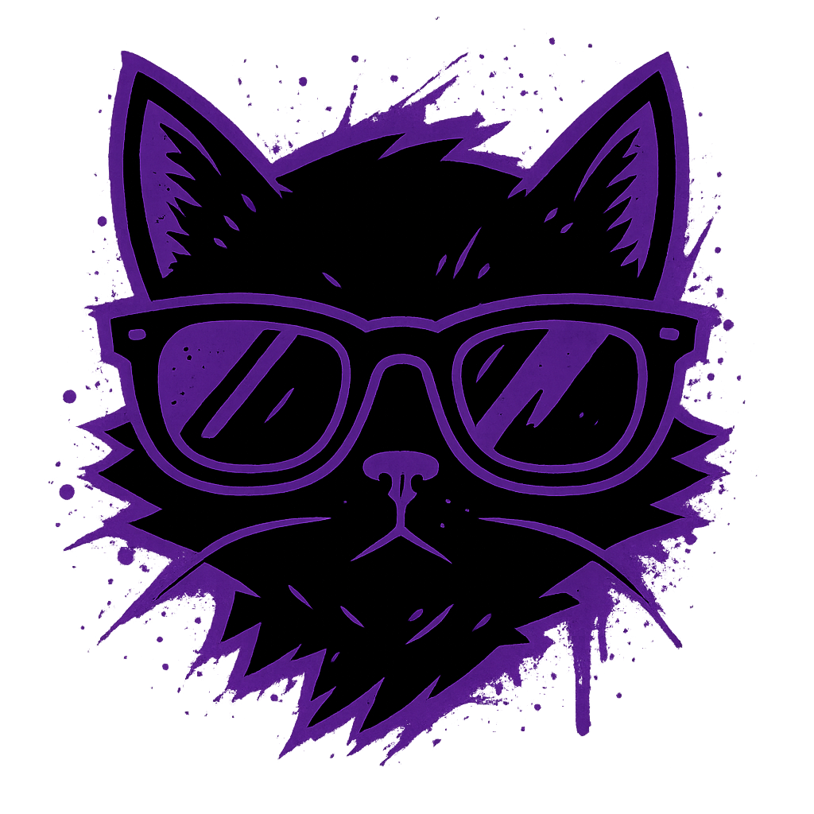

<p align="center">
  
</p>

<h1 align="center">NoirVu</h1>
<p align="center"><strong>The coolest Nostr app. Ever. Period.</strong></p>

---

## 🚀 Getting Started

### 🪟 Run from Command Prompt

1. Open **Command Prompt**
2. Navigate to your project folder:
   ```bash
   cd C:\Users\<YourName>\Documents\NoirVu
3. Install dependencies:
   ```bash
   npm install
4. Start the app:
   ```bash
   npm run start

✨ Working Features

✅ Login with Nostr NSECs
✅ Generate new Nostr Keys
✅ Post to your personal Nostr feed
✅ Reply, react, and share notes on Nostr

🧩 Upcoming Features

🕹️ Channel + Channel Chats
🛰️ Server Backend Integration
🎙️ Audio & Video Support
📡 Live Streaming
🔔 Notifications
👥 Friends List
💡 …and much more to come!

💜 About NoirVu

NoirVu blends sleek cyber aesthetics with the power of the Nostr protocol — built with
Electron + Nostr-tools for a next-gen decentralized chat and social experience.

<p align="center"> <sub>© 2025 NoirVu — Built with love by CraigTheSpaceBum.</sub> </p> ```
